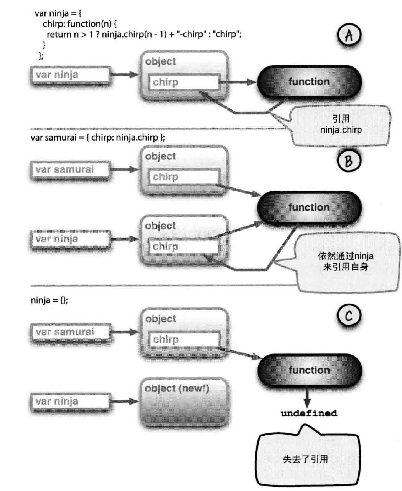

> 从名字即可看书，改篇博客总结与《JavaScript忍者秘籍》。对于JavaScript来说，函数为第一类型对象。所以这里，我们主要是介绍JavaScript中函数的运用。

## 匿名函数

对于什么是匿名函数，这里就不做过多介绍了。我们需要知道的是，对于JavaScript而言，匿名函数是一个很重要且具有逻辑性的特性。通常，匿名函数的使用情况是：创建一个供以后使用的函数。

简单的举个例子如下：

```javascript
window.onload = function() {
  alert('hello');
}
var templateObj = {
    shout:function() {
      alert('作为方法的匿名函数')
    }
}
templateObj.shout();

setTimeout(function() {
  alert('这也是一个匿名函数');
},1000)
```

上面的一个代码片段我就不做过多无用解释了，比较常规。

## 递归

递归，说白了，就是自己调用自己，或者调用另外一个函数，但是这个函数的调用树的某一个地方又调用了自己。所以递归，就产生了。

### 普通命名函数的递归

拿普通命名函数的递归最好的举例就是用最简单的递归需求：检测回文。

回文的定义如下：一个短语，不管从哪一个方向读，都是一样的。检测的工作当然方法多样，我们可以创建一个函数，用待检测的回文字符逆序生成出一个字符，然后检测二者是否相同，如果相同，则为回文字符。

但是这种方法并不是很有逼格，确切的说，代价比较大，因为我们需要分配并创建新的字符。

所以，我们可以整理出如下简洁的办法：
- 单个和零个字符都是回文
- 如果字符串的第一个字符和最后一个字符相同，并且除了两个字符以外，别的字符也满足该要求，那么我们就可以检测出来了这个是回文了

```javascript
function isPalindrome(txt) {
  if(txt.length<=1){
      return true;
  }
  if(txt.charAt(0)!= txt.charAt(txt.length-1)) return false;
  return isPalindrome(txt.substr(1,txt.length-2));
}
```

上面的代码我们并没有做txt的一些类型检测，undefined、null等。

### 方法中的递归

所谓的方法，自然离不开对象，直接看例子：

```javascript
var ninja = {
    chirp:function(n) {
      return n>1?ninja.chirp(n-1)+'-chirp':'chirp';
    }
}
console.log(ninja.chirp(3))//chirp-chirp-chirp
```

在上述代码中，我们通过对象ninja.chirp方法的递归调用了自己。但是，因为我们在函数上s会用了非直接引用，也就是ninja对象的chirp属性，所以才能够实现递归，这也就引出来一个问题：引用丢失

### 引用丢失的问题

上面的示例代码，依赖于一个进行递归调用的对象属性引用。与函数的实际名称不同，因为这种引用可能是暂时的。

```javascript
var ninja = {
    chirp:function(n) {
      return n>1?ninja.chirp(n-1)+'-chirp':'chirp';
    }
}
var samurai = {chirp:ninja.chirp};
ninja = {};

try{
    console.log(samurai.chirp(3) === 'chirp-chirp-chirp')
}catch (err){
    if(err) alert(false);
}
```

如上，我们把ninja属性上的方法赋值给了samurai，然后置空ninja，然后你懂得~这就是引用丢失的问题。

***截图自《JavaScript忍者秘籍》***

通过完善之前对匿名函数的粗略定义，我们可以修复解决这个问题。在匿名函数中，我们不在使用显示的ninja引用。这里我们使用this（关于this的使用详解，请关注我的个人微信公众号：前端的全栈之路）。

```javascript
var ninja = {
    chirp:function(n) {
      return n>1?this.chirp(n-1)+'-chirp':'chirp';
    }
}
```
当函数作为方法被调用的时候，函数的上下文指的是该方法的对象。

使用this调用，可以让我们的匿名函数更加的强大且灵活。但是。。。

### 内联命名函数

上面我们解决了作为函数方法作为递归时候的一个完美操作。但实际上，不管是否进行方法递归，巧妙使用this都是我们应该所掌握的（关注微信公众号，早晚都给你说到）。

话说回来，其实这样写也还是有问题的，问题在于给对象定义方法的时候，方法名称是写死的，如果属性名称不一样，岂不是一样会丢失引用？

所以，这里我们采用另一种解决方案，给匿名函数起个名字吧！对的，肯定又人会说，我擦！那还是匿名函数么？嗯。。。好吧，那就不叫匿名函数了吧，叫内联函数~

```javascript
var ninja = {
    chirp:function signal(n) {
      return n>1?signal(n-1)+'-chirp':'chirp';
    }
}
var samurai = {chirps:ninja.chirp};
ninja = {};

try{
    console.log(samurai.chirps(3) === 'chirp-chirp-chirp')
}catch (err){
    if(err) alert(false);
}
```

所以如上的解决办法，就完美解决了我们之前说到所有问题。内联函数还有一个很重要的一点，就是尽管可以给内联函数进行命名，但是这些名称只能在自身函数内部才可见。

## 将函数视为对象

JavaScript中的函数和其他语言中的函数有所不同，JavaScript赋予了函数很多的特性，其中最重要的特性之一就是函数作为第一类型对象。是的，对象！

所以，我们可以给函数添加属性，甚至可以添加方法。

### 函数存储
有时候，我们可能需要存储一组相关但又独立的函数，事件回调管理是最为明显的例子。向这个集合添加函数时候，我们得知道哪些函数在集合中存在，否则不添加。

```javascript
var store = {
    nextId:1,
    cache:{},
    add:function(fn) {
      if(!fn.id){
          fn.id = store.nextId++;
          return !!(store.cache[fn.id] = fn);
      }
    }
}

function ninja() {}

console.log(store.add(ninja));
console.log(store.add(ninja));
```
上述代码比较简单常规，也就不做过多解释。

### 自记忆函数

缓存记忆是构造函数的过程，这种函数能够记住先前计算的结果。通过避免重复的计算，极大地提高性能。

#### 缓存记忆昂贵的计算结果

作为一个简单的例子，这里我来判断一个数字是否为素数。

```javascript
function isPrime(value) {
  if(!isPrime.answers) isPrime.answers = {};
  if(isPrime.answers[value]!=null){
      return isPrime.answers[value]
  }
  var prime = value != 1;//1 不是素数
  for(var i = 2;i<value;i++){
      if(value%2===0){
          prime = false;
          break;
      }
  }
  return isPrime.answers[value] = prime
}
console.log(isPrime(5));
console.log(isPrime.answers[5]);
```
如上代码也都是常规操作，不做过多解释。我们可以通过下面的console.log判断出缓存是否成功。

缓存记忆有两个主要的优点：
- 在函数调用获取之前计算结果的时候，最终用户享有性能优势
- 发生在幕后，完全无缝，最终用户和开发者都无需任何特殊的操作或者为此做任何初始化工作。

当然，总归会有缺点的
- 为了提高性能，任何类型的缓存肯定会牺牲内存
- 纯粹主义者可能认为缓存这个问题不应该与业务逻辑放到一起。一个函数或者方法只应该做一件事。
- 很难测试和测量一个算法的性能。（比如我们这个“简单”的例子）

#### 缓存DOM记忆
通过元素标签名来获取DOM元素是一个非常常见的操作。但是性能可能不是特别好。所以从上面的缓存记忆我们可以进行如下的骚操作：

```javascript
function getElements(name) {
  if(getElements.cache) getElements.cache = {};
  return getElements.cache[name] = getElements.cache[name]||document.getElementsByTagName(name); 
}
```
上面的代码很简单，但是有么有眼前一亮的感觉呢？？我有！而且我们还发现，这个简单的缓存的代码产生了5倍以上的性能提升。

我们可以将状态和缓存信息存储在一个封装的独立位置上，不仅在代码组织上有好处，而且外部存储或缓存对象无需污染作用域，就可以获取性能的提升。

别激动，下面还有更多的奇淫技巧~

### 伪造数组方法

有时候我们想创建一个包含一组数据的对象。如果只是集合，则只需要创建一个数组即可。但是在某些情况下，除了集合本身，可能会有更多的状体需要保存。

一种选择是，每次创建对象新版本的时候都创建一个新数组，然后将元数据作为属性或者方法添加到这个新数组上。但是这个操作太常规了。

欣赏如下骚操作：
```html
<html>
<head></head>
<body>
<input id="first">
<input id="second">
<script>
var elems = {
    length:0,
    add:function(elem) {
      Array.prototype.push.call(this,elem);
    },
    gather:function(id) {
      this.add(document.getElementById(id));
    }
}
elems.gather('first');
console.log(elems.length,elems[0].nodeType);
elems.gather('second');
console.log(elems.length,elems[1].nodeType);
</script>
</body>
</html>
```

通常，Array.prototype.push()是通过其函数上下文操作其自身数组的。这里我们通过call方法来讲我们自己的对象扮演了一次他的上下文。push的方法会增加length的值（会认为他就是数组的length属性），然后给对象添加一个数字属性，并将其引用到传入的元素上。

关于函数的执行上下文，以及prototype的一些说明，将在后续文章写到。

## 可变函数的参数列表

JavaScript灵活且强大的特性之一是函数可以接受任意数量的参数。虽然JavaScript没有函数的重载，但是参数列表的灵活性是获取其他语言类似重载功能的关键所在

### 使用apply()支持可变参数

需求：查找数组中的最大值、最小值

一开始，我认为Math中提供的min(),max()可以满足，但是貌似他并不能够找到数组中的最大值最小值，难道要我这样：Math.min(arr[0],arr[1],arr[3]...)??

来吧，我们继续我们的奇淫技巧。

```javascript
function smallest(arr) {
  return Math.min.apply(Math,arr);
}
function largest(arr) {
  return Math.max.apply(Math,arr);
}

console.log(smallest([0,1,2,3,4]));
console.log(largest([0,1,2,3,4]));
```
不做过多解释，操作常规，是不是又是一个眼前一亮呢？

### 函数重载


