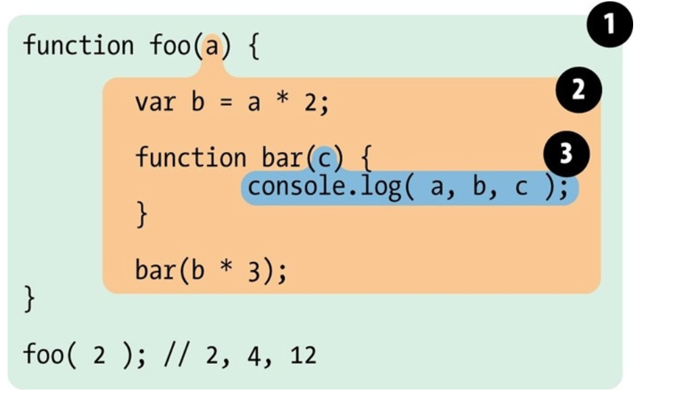

# 妈妈再也不用担心面试官问我闭包了

> 网上总结闭包的文章已经烂大街了，不敢说笔者这篇文章多么多么xxx，只是个人理解总结。各位看官瞅瞅就好，大神还希望多多指正。此篇文章总结与《JavaScript忍者秘籍》 《你不知道的JavaScript上卷》

> 安利个人react技术栈+express+mongoose实战个人博客教程 [React-Express-Blog-Demo](https://github.com/Nealyang/React-Express-Blog-Demo)

## 前言
为什么我们需要理解并且掌握闭包，且不说大道理，就问你要不要成为JavaScript高手？不要？那你要不要面试找工作嘛。。。

再者，对于任何一个前端er或者JavaScript开发者来说，理解闭包可以看做是另一种意义上的重生。闭包是纯函数编程语言的一个特性，因为他大大简化复杂的操作，所以很容易在一些JavaScript库以及其他高级代码中找到闭包的使用。

一言以蔽之，闭包，你就得掌握。

## 谈谈闭包之前，我们先说说作用域
这里我们要说的作用域值得是词法作用域。词法作用域即为定义在词法阶段的作用域。换句话说，就是你写代码时将变量和块作用域写在哪里所决定的。因此在词法解析的时会保持作用域不变。（JavaScript引擎在运行JavaScript代码的时候大致经过分词/词法分析、解析/语法分析、代码生成三个步骤）。

老规矩，看代码（就是代码多~~）

```javascript
function foo(a) {
  var b = a*2;
  function bar(c) {
    console.log(a,b,c);
  }
  bar(b*3);
}
foo(2);//2 4 6
```
这个例子中有三个逐级嵌套的作用域，如图：

***截图来自《你不知道的JavaScript》***

部分一包含整个作用域也就是全局作用域。其中包含标识符：foo

部分二包含foo所创建的作用域，其中包含：a,bar和b

部分三包含bar所创建的作用域，其中包含：c 

这些作用域气泡的包含关系给引擎提供了足够多的位置信息。在上面的代码中，引擎执行console.log的时候，并查找a，b，c。他首先在最里面的作用域，也就是bar(...)函数的作用域。引擎无法在这一层作用域中找到变量a，因此引擎会去上一级嵌套作用域foo(...)中查找，如果找到了，则即使用。

如果a，c 都存在作用域bar(...),foo(...)作用域中，console.log(...)即不需要到foo的外部作用域中去查找变量。

无论函数在哪里被调用，且无论他们如何被调用，他的词法作用域都只由函数被声明的位置决定的。词法作用域查找只会查找一级标识符，比如a，b和c。

简单理解词法作用域的概念，其实也就是我们常说的作用域，关于JavaScript中欺骗词法以及更多关于词法作用域的介绍，请翻阅《你不知道的JavaScript》。

## 闭包的概念

说到闭包的概念，这里还真的比较模糊，我们且看下各种经典书籍给出的概念

### 《JavaScript权威指南》中的概念
函数对象可以通过作用域链互相关联起来,函数体内部的变量都可以保存在函数作用域内,这种特性在计算机科学中成为闭包

### 《JavaScript权威指南》中的概念
闭包是指有权访问另一个函数作用域中的变量的函数。

### 《JavaScript忍者秘籍》中的概念
闭包是一个函数在创建时允许该自身函数访问并操作该自身函数以外的变量时所创建的作用域。

### 《你不知道的JavaScript》中的概念
闭包是基于词法作用域书写代码时所产生的自然结果。当函数记住并访问所在的词法作用域，闭包就产生了。

### 个人理解
闭包就是一个函数，一个可以访问并操作其他函数内部变量的函数。也可以说是一个定义在函数内部的函数。因为JavaScript没有动态作用域，而闭包的本质是静态作用域（静态作用域规则查找一个变量声明时依赖的是源程序中块之间的静态关系），所以函数访问的都是我们定义时候的作用域，也就是词法作用域。所以闭包才会得以实现。

我们常见的闭包形式就是a 函数套 b 函数，然后 a 函数返回 b 函数，这样 b 函数在 a 函数以外的地方执行时，依然能访问 a 函数的作用域。其中“b 函数在 a 函数以外的地方执行时”这一点，才体现了闭包的真正的强大之处。


## 实质性的问题

```javascript
function outer() {
  var a = 2;
  function inner() {
    console.log(a);//2
  }
  inner();
}
outer();
```
基于词法作用域和查找规则，inner函数是可以访问到outer内部定义的变量a的。从技术上讲，这就是闭包。但是也可以说不是，因为用来解释inner对a的引用方法是词法作用域的查找规则，而这些规则只是闭包中的一部分而已。

下面我们将上面的代码修改下，让我们能够清晰的看到闭包
```javascript
function outer() {
  var a = 2;
  function inner() {
    console.log(a);
  }
  return inner;
}
var neal = outer();
neal();//2
```
可能是所有讲解闭包的博客中都用烂了的例子了。这里inner函数被正常调用执行，并且可以访问到outer函数里定义的变量a。讲道理，在outer函数运行后，通常函数整个内部作用域都会被销毁。

而闭包的神奇之处正是如此可以阻止垃圾回收这种事情的发生，事实上，内部作用域已然存在且拿着a变量，所以没有被回收。inner函数拥有outer函数内部作用域的闭包，使得该作用域能够一直存活，以供inner函数在之后的任何时间可以访问。

inner()已然持有对该作用域的引用，而这个引用就被叫做闭包。

函数在定义时的词法作用域以外的地方被调用，闭包使得函数可以继续访问定义时的词法作用域。

***无论通过何种手段将内部函数传递到所在的词法作用域以外，它都会持有对原始定义作用域的引用，无论在何处执行这个函数都会使用闭包***
```javascript
var fn;
function foo() {
  var a = 2;
  function baz() {
    console.log(a);
  }
  fn = baz;
}

function bar() {
  fn();
}
foo();
bar();
```

上面的代码不做过多解释，挺简单，通过下面的代码，我们再说下闭包的三个有趣的概念

```javascript
var outerValue = 'ninja';
var later;
function outFunction() {
  var innerValue = 'Neal';
  function innerFunction(param){
      console.log(outerValue,innerValue,param,tooLate);
  }
  later = innerFunction;
}
console.log('tooLate is',tooLate);
outFunction();
later('Nealyang');
var tooLate = 'Haha';
later('Neal_yang');

//tooLate is undefined
//ninja Neal Nealyang undefined
//ninja Neal Neal_yang Haha
```
上面代码运行结果大家可以自行尝试。总之，从上面的代码中，我们可以看到闭包的有趣的三个概念
- 内部函数的参数包含在闭包中
- 作用域之外的所有变量、即便是函数声明之后的那些声明，也都包含在闭包中.
- 相同作用域内，尚未声明的变量，不能进行提前引用

## 代码处处有闭包

```javascript
function wait(message) {
     setTimeout( function timer() {
         console.log( message ); }, 1000 ); }
wait( "Hello, closure!" );
```
如上的代码，一个很常见的定时器，但是timer函数具有涵盖wait作用域的闭包，因为此还保留对变量Message的引用。

wait执行1s后，他的内部作用域并不会消失，timer函数依然保持有wait作用域的闭包。

深入到引擎内部原理中，内置的g工具函数setTimeout持有对一个参数的引用，引擎调用这个函数，在例子中就是内部的timer函数，而词法作用域在这个过程中保持完整。这就是闭包。

无论何时何地，如果将函数作为第一级值类型并到处传递，你就会看到闭包在这些函数中的使用。在定时器、事件监听、Ajax请求、跨窗口通信或者其他异步任务中，只要使用回调函数，就在使用闭包。

## 在经典的for循环中使用闭包

```javascript
for (var i=1; i<=5; i++) {
     setTimeout( function timer() {
         console.log( i ); }, i*1000 ); }
```

如上for循环，大家都知道输出6，毕竟这个作用域中，我们只有一个i，所有的回调函数都是在这个for循环结束以后才执行的。

如果我们试图假设循环中的每一个迭代在运行时都会给自己捕获一个i的副本，但是根据作用域的工作原理，尽管循环中五个函数是在各个迭代中分别定义，但是他们都被封闭在共享的作用域中，因此还是只有一个i。

所以回到正题，我们需要使用闭包，在每一个循环中每一个迭代都让他产生一个闭包作用域。

所以我们代码修改如下：
```javascript
for (var i=1; i<=5; i++) { (function() {
         setTimeout( function timer() {
             console.log( i ); }, i*1000 ); })(); }
```

but！！！你也发现了，这样并不姓，不是IIFE会产生一个闭包的么？是的没错，但是如果这个IIFE产生的闭包作用域是可空的，那么将它封装起来又有什么意义呢？所以它需要点实质性的东西，让我们去使用。

```javascript
 for (var i=1; i<=5; i++) { (function(j) {
         setTimeout( function timer() {
console.log( j ); }, j*1000 ); })( i ); }
```

当然，如上问题我们可以使用es6中的let来解决。但是这里就不做过多说明了。大家可以自行Google。

## 模块
这个部分比较简单好理解，因为闭包可以很好形成块级作用域，对内部变量有很好的隐藏。所以自然我们可以将其作为模块开发的手段。撇开如今的export、import不谈

直接看例子就好，操作比较常规

````javascript
function foo() {
    var something = "cool"; 
    var another = [1, 2, 3];
    function doSomething() {
         console.log( something ); 
    } 
    function doAnother() {
         console.log( another.join( " ! " ) ); 
    }
    return {
        doSomething:doSomething,
        doAnother:doAnother
    }
}
````

简单说明下，doSomething和doAnother函数具有涵盖模块实例内部作用域的闭包。当通过返回一个含有属性引用的对象的方式来将函数传递到词法作用域外部，我们已经创造了可以观察和实践的 闭包条件。

- 必须有外部的封闭函数，该函数必须至少被调用一次
- 封闭函数必须返回至少一个内部函数，这样内部函数才能在私有作用域中形成闭包，并且可以访问或修改私有的状态。

当然，上面的代码我们还可以写成IIFE的形式。但是毕竟市场上讲解闭包的好文是在太多，这里我们就点到为止。

