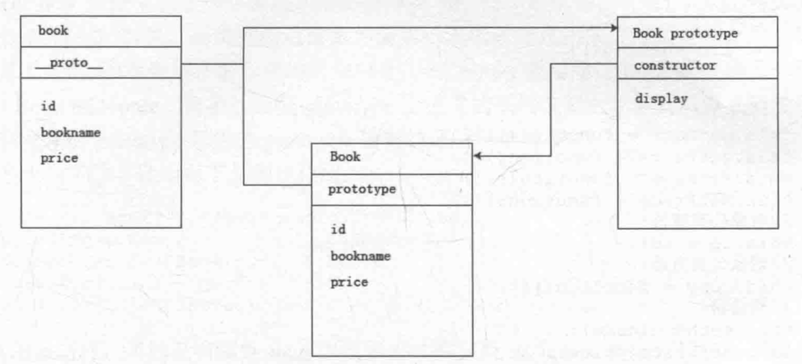
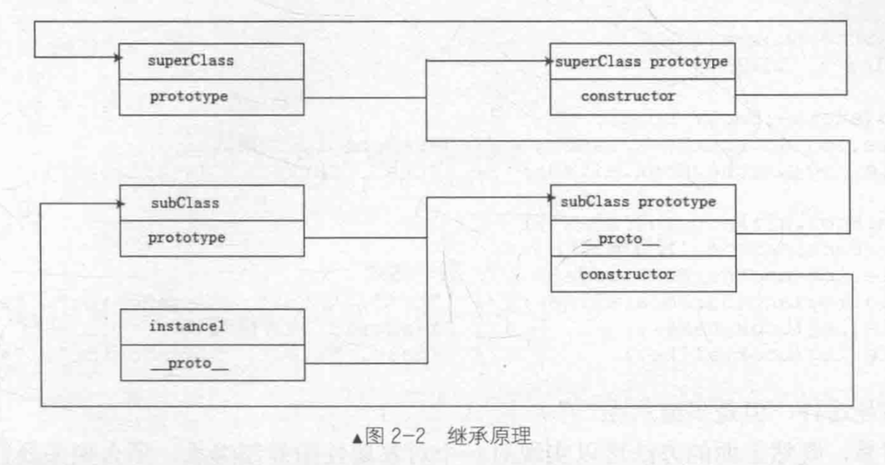

# 面向对象编程

> 此篇总结与《JavaScript设计模式》github地址 [YOU-SHOULD-KNOW-JS](https://github.com/Nealyang/YOU-SHOULD-KNOW-JS)

## 封装
### 创建一个类
在JavaScript中创建一个对象很容易，首先声明一个函数保存在一个变量里。按编程习惯一般将这个变量名的首字母大写。然后内部通过this变量来添加属性或者方法来实现对类添加属性和行为。

```javascript
var Book = function(id,bookname,price) {
  this.id = id;
  this.bookename = bookname;
  this.price = price;
}
```
当然，我们也可以通过在类的原型上添加属性和方法。有两种方式：
```javascript
Book.prototype.display = function() {
  //展示展示这本书
}

//或者
Book.prototype = {
    display:function() {
      //展示这本书
    }
}
```

这样，我们就将我们所需要的方法和属性都封装到我们封装的Book类里面了，当使用这些功能和方法的时候，我们不能直接使用这些类，而是需要使用关键字new来实例化新的对象。
```javascript
var book = new Book(10,'JavaScript设计模式',20);
console.log(book.bookname);
```
注意，通过this添加的属性和方法是在当前对象上添加的，然而JavaScript是一种基于原型的语言，所以每创建一个对象时，他都有一个prototype用于指向其继承的属性、方法。这样通过prototype继承的方法并不是对象自身的，所以在使用这些方法时，需要通过prototype一层一层往上查找。

简单的说，通过this定的属性和方法是该对象自身拥有的，所以我们每次通过类创建的一个新对象时，this执行的属性和方法都会得到相应的创建，而通过prototype继承的属性和方法是每一个对象通过prototype访问到的。所以我们每一次通过类创建一个新对象时，这些属性和方法不会再次创建。


如上图，实例的__proto__属性执行原型。原型的constructor属性指向构造函数。当创建一个函数或者对象时都会为其创建一个原型对象prototype，在prototype对象中，又会像函数中创建this一样创建一个constructor属性，这个属性指向的就是拥有整个原型对象的函数或者对象。

### 属性与方法封装
由于JavaScript是函数级作用域，申明在函数内部的变量或者方法在外部是访问不到的，通过此特性即可创建类的私有变量和私有方法。然而在函数内部通过this创建的属性和方法，在类创建对象时，每个对象自身都拥有一份，并且在外部访问到。因此用this创建的属性可以看做是对象的共有属性和共有方法。而通过this创建的方法不但可以访问这些对象的共有属性和共有方法，还可以访问类自身的私有属性和私有方法，这权利比较大，所以我们称之为特权方法。
在创建对象时，我们可以使用这些特权方法来初始化实例对象的一些属性，因此这些在创建对象时，调用的特权方法可以看做是类的构造器

```javascript
var Book = function(id,name,price) {
  //私有属性
  var num = 1;
  //私有方法
  function checkId() {
    
  }
  
  //特权方法
  this.getName = function() {}
  this.getPrice = function() {}
  this.setName = function() {}
  this.setPrice = function() {}
  //对象共有属性
  this.id  = id;
  //对象共有方法
  this.copy = function() {
    
  }
  //构造器
  this.setName(name);
  this.setPrice(price);
}
```

通过new关键字创建新对象时，由于类外面通过点语法添加的属性和方法没有执行到，所以新创建的对象中无法获取他们，当时可以通过类来使用。因此我们称之为静态共有属性和静态共有方法。而通过类的prototype创建的属性和方法在类的实例中可以通过this访问到的（新创建对象的__ptoto__指向类的原型所指的对象），所以我们将prototype中的属性和方法称之为共有属性和方法
```javascript
//静态的共有属性和方法，对象不能访问
Book.isChinese = true;
Book.setTime = function() {
  console.log('new time');
}
Book.prototype  = function() {
    //共有属性和方法
  isBook:true;
  display = function() {
    
  }
}
```
通过new关键字创建的对象，实际上是对新对象this的不断赋值，并将prototype指向类的prototype所指向的对象，而类的构造函数外面的通过点语法添加的属性和方法不会添加到新创建的对象上去。

### 闭包的实现
有时候我们经常将类的静态变量通过闭包来实现
 ```javascript
var Book = (function() {
    //静态私有变量、静态私有方法
  var bookNum = 0;
  function checkBook(name) {
    
  }
  //返回构造函数
  return function(newId,newName,newPrice) {
      //私有变量、方法
    var name,price;
    function checkId(id) {
      
    }
    //特权方法
    this.getName = function(){};
    this.getPrice = function(){};
    this.setName = function(){};
    this.setPrice  = function(){};
    //公有属性、公有方法
    this.id = newId;
    this.copy = function(){};
    bookNum++;
    if(bookNum>100){
        throw  new Error('我们仅出版了100本书');
    }
    //构造器
    this.setNmae(name);
    this.setPrice(price)
  }
})()
Book.prototype =  {
    //静态共有属性、静态公有方法
  isJsBook:false,
  display:function() {
    
  }
}
```

闭包就是有权访问另外一个函数作用域中变量的函数，即在一个函数内部创建另外一个函数。我们将这个闭包作为创建对象的构造函数，这样，它既是闭包又是可实例化对象的函数，即可访问到类作用域中的变量。但是在闭包外部添加原型属性和方法看上去似乎脱离闭包这个类，所以咱们可以用下面的方式来搞一搞

```javascript
var Book = (function() {
  //静态私有变量
  var bookNum = 0;
  //静态私有方法
  function checkBook(name) {
    console.log(name);
  }
  function _book(newId,newName,newPrice) {
    //私有变量
    var name,price;
    //私有方法
    function checkId(id) {
      console.log(id)
    }
    //特权方法
    this.getName = function(){};
    this.getPrice = function(){};
    this.setName = function(){};
    this.setPrice = function(){};
    //公有属性
    this.id = newId;
    //公有方法
    this.copy = function(){};
    bookNum++;
    if(bookNum>100)
        throw new Error('我们仅仅出版了100本书');
    //构造器
    this.setName(name);
    this.setPrice(price)
  }
  _book.prototype = {
      //静态共有属性、方法
      isJSBook:false,
      display:function() {
        console.log('display')
      }
  }
  return _book;
})()
```

## 继承
### 类式继承
```javascript
function SuperClass() {
  this.superValue = true;
}
SuperClass.prototype.getSuperValue = function() {
  return this.superValue;
}

function SubClass() {
  this.subValue = false;
}
SubClass.prototype = new SubClass();

SubClass.prototype.getSubValue = function() {
  return this.subValue;
}
```
继承非常简单，就是声明两个类而已，不过类式继承需要将第一个类的实例赋值给第二个类的原型，因为类的原型对象作用就是为类的原型添加共有方法，但是类不能直接访问这些属性和方法，必须通过原型prototype来访问。而我们实例化一个父类的时候，新创建的对象复制了父类构造函数的属性和方法并将原型__proto__指向父类的原型对象，这样就拥有了父类原型对象的属性和方法，并且这个新创建的对象可以直接访父类原型对象上的属性和方法。而且新创建的对象不仅仅可以访问父类原型上的属性和方法，同样可以访问父类构造函数中复制的属性和方法。将这个对象赋值给子类的原型，那么这个子类的原型同样可以访问父类原型上的属性和方法与从父类构造函数中复制的属性和方法。

另外，我们可以通过instanceof来检测某个对象是否为某个类的实例
```javascript
var instance = new SubClass();

console.log(instance instanceof SuperClass)
console.log(instance instanceof SubClass)
console.log(SubClass instanceof SuperClass)
```

关于结果大家可以自行尝试。注意，instanceof是判断对象是否是后面类的实例，它并不表示二者的继承。
```javascript
console.log(SubClass.prototype instanceof SuperClass);
```

但是这种类式继承有两个缺点，其一，由于子类通过其原型prototype对父类实例化，继承了父类，所以说父类中如果共有属性是引用类型，就会在子类中被所有的实例所共享，因此一个子类的实例更改子类原型从父类构造函数中继承的共有属性就会直接影响到其他的子类。
```javascript
function SuperClass() {
  this.books = ['js','css'];
}
function SubClass() {}
SubClass.prototype = new SuperClass();

var instance1  = new SubClass();
var instance2 = new SubClass();
console.log(instance2.books);
instance1.books.push('html');
console.log(instance1.books,instance2.books)
```
其二，由于子类实现的继承是靠其原型prototype对父类进行实例化实现的，因此在创建父类的时候，是无法向父类传递参数的。因而在实例化父类的时候也无法对父类构造函数内的属性进行初始化

### 构造函数继承
直接看代码
```javascript
function SuperClass(id) {
  this.books = ['js','css'];
  this.id = id;
}
SuperClass.prototype.showBooks = function() {
  console.log(this.books);
}
function SubClass(id) {
  //继承父类
  SuperClass.call(this,id);
}
//创建第一个子类实例
var instance1 = new SubClass(10);
//创建第二个子类实例
var instance2 = new SubClass(11);

instance1.books.push('html');
console.log(instance1)
console.log(instance2)
instance1.showBooks();//TypeError
```
如上，SuperClass.call(this,id)当然就是构造函数继承的核心语句了，由于call这个方法可以更改函数的作用环境，因此在子类中，对superClass调用这个方法就是将子类中的变量在父类中执行一遍。由于父类中给this绑定属性，因此子类自然也就继承父类的共有属性。由于这种类型的继承没有涉及到原型prototype，所以父类的原型方法自然不会被子类继承，而如果想被子类继承，就必须放到构造函数中，这样创建出来的每一个实例都会单独的拥有一份而不能共用，这样就违背了代码复用的原则，所以综合上述两种，我们提出了组合式继承方法

### 组合继承

类式继承是通过子类原型prototype对父类实例化实现的，构造函数继承是通过在子类的构造函数作用环境中执行一次父类的构造函数来实现的。

```javascript
function SuperClass(name) {
  this.name = name; 
  this.books = ['Js','CSS'];
}
SuperClass.prototype.getBooks = function() {
    console.log(this.books);
}
function SubClass(name,time) {
  SuperClass.call(this,name);
  this.time = time;
}
SubClass.prototype = new SuperClass();

SubClass.prototype.getTime = function() {
  console.log(this.time);
}
```

如上，我们就解决了之前说到的一些问题，但是是不是从代码看，还是有些不爽呢？至少这个SuperClass的构造函数执行了两遍就感觉非常的不妥。

### 原型式继承
原型式继承大致的实现方式是这个样子的
```javascript
function inheritObject(o) {
    //申明一个过渡对象
  function F() { }
  //过渡对象的原型继承父对象
  F.prototype = o;
  //返回过渡对象的实例，该对象的原型继承了父对象
  return new F();
}
```
其实这种方式和类式继承非常的相似，他只是对类式继承的一个封装，其中的过渡对象就相当于类式继承的子类，只不过在原型继承中作为一个普通的过渡对象存在，目的是为了创建要返回的新的实例对象。

```javascript
var book = {
    name:'js book',
    likeBook:['css Book','html book']
}
var newBook = inheritObject(book);
newBook.name = 'ajax book';
newBook.likeBook.push('react book');
var otherBook = inheritObject(book);
otherBook.name = 'canvas book';
otherBook.likeBook.push('node book');
console.log(newBook,otherBook);
```
如上代码我们可以看出，原型式继承和类式继承一个样子，对于引用类型的变量，还是存在子类实例共享的情况。

所以，我们还有下面的寄生式继承

### 寄生式继承
直接看代码
```javascript
var book = {
    name:'js book',
    likeBook:['html book','css book']
}
function createBook(obj) {
    //通过原型方式创建新的对象
  var o = new inheritObject(obj);
  // 拓展新对象
  o.getName = function(name) {
    console.log(name)
  }
  // 返回拓展后的新对象
  return o;
}
```
其实寄生式继承就是对原型继承的拓展，一个二次封装的过程，这样新创建的对象不仅仅有父类的属性和方法，还新增了别的属性和方法。


### 寄生组合式继承
回到之前的组合式继承，那时候我们将类式继承和构造函数继承组合使用，但是存在的问题就是子类不是父类的实例，而子类的原型是父类的实例，所以才有了寄生组合式继承。

而寄生组合式继承是寄生式继承和构造函数继承的组合。但是这里寄生式继承有些特殊，这里他处理不是对象，而是类的原型。

```javascript
function inheritPrototype(subClass,superClass) {
    // 复制一份父类的原型副本到变量中
  var p = inheritObject(superClass.prototype);
  // 修正因为重写子类的原型导致子类的constructor属性被修改
  p.constructor = subClass;
  // 设置子类原型
  subClass.prototype = p;
}
```
组合式继承中，通过构造函数继承的属性和方法都是没有问题的，所以这里我们主要探究通过寄生式继承重新继承父类的原型。我们需要继承的仅仅是父类的原型，不用去调用父类的构造函数。换句话说，在构造函数继承中，我们已经调用了父类的构造函数。因此我们需要的就是父类的原型对象的一个副本，而这个副本我们可以通过原型继承拿到，但是这么直接赋值给子类会有问题，因为对父类原型对象复制得到的复制对象p中的constructor属性指向的不是subClass子类对象，因此在寄生式继承中要对复制对象p做一次增强，修复起constructor属性指向性不正确的问题，最后将得到的复制对象p赋值给子类原型，这样子类的原型就继承了父类的原型并且没有执行父类的构造函数。


```javascript
function inheritPrototype(subClass,superClass) {
    // 复制一份父类的原型副本到变量中
  var p = inheritObject(superClass.prototype);
  // 修正因为重写子类的原型导致子类的constructor属性被修改
  p.constructor = subClass;
  // 设置子类原型
  subClass.prototype = p;
}
function inheritObject(o) {
    //申明一个过渡对象
  function F() { }
  //过渡对象的原型继承父对象
  F.prototype = o;
  //返回过渡对象的实例，该对象的原型继承了父对象
  return new F();
}
function SuperClass(name) {
  this.name = name;
  this.books=['js book','css book'];
}
SuperClass.prototype.getName = function() {
  console.log(this.name);
}
function SubClass(name,time) {
  SuperClass.call(this,name);
  this.time = time;
}
inheritPrototype(SubClass,SuperClass);
SubClass.prototype.getTime = function() {
  console.log(this.time);
}
var instance1 = new SubClass('React','2017/11/11')
var instance2 = new SubClass('Js','2018/22/33');

instance1.books.push('test book');

console.log(instance1.books,instance2.books);
instance2.getName();
instance2.getTime();
```



这种方式继承其实如上图所示，其中最大的改变就是子类原型中的处理，被赋予父类原型中的一个引用，这是一个对象，因此有一点你需要注意，就是子类在想添加原型方法必须通过prototype.来添加，否则直接赋予对象就会覆盖从父类原型继承的对象了。

## 多继承
由于JavaScript中的继承是通过原型链来实现的，只有一条原型链，所以理论上来说是实现不了继承多个父类的。但是我们可以通过一些小技巧，来实现一个类似的多继承

```javascript
var extend = function(target,source) {
  //  遍历源对象中的属性
  for(var property in source){
      //将源对象中的属性复制到目标对象中
      target[property] = source[property];
  }
  //返回目标对象
  return target;
}
```
当然，此处我们实现的这是浅复制，对于引用类型的它还是无能为力的。jquery中实现了深复制，就是将源对象中的引用类型的属性再执行一遍extend方法而实现。这里我们实现的比较简单。

```javascript
var book = {
    name:'javascript 设计模式',
    alike:['css','html']
}
var another = {
    color:'blue'
};
extend(another,book);
console.log(another.name);
console.log(another.alike);
another.alike.push('React');
another.name = '设计模式'；
console.log(another,book);
```

上面是实现一个对象的赋值，当然，多继承，也就是在外层多套一个循环的事情了，这里就不在赘述了

## 多态
多态，其实就是同一个方法多种的调用方式，在JavaScript中其实有很多种实现方式的。只不过要对传入的参数进行判断以实现多种的调用方式。

操作比较常规，这里就不再赘述了。可以参考我的另一篇文章[忍者级别的函数操作](https://github.com/Nealyang/YOU-SHOULD-KNOW-JS/blob/master/doc/basic_js/%E5%BF%8D%E8%80%85%E7%BA%A7%E5%88%AB%E7%9A%84%E6%93%8D%E4%BD%9C%E5%87%BD%E6%95%B0.md)